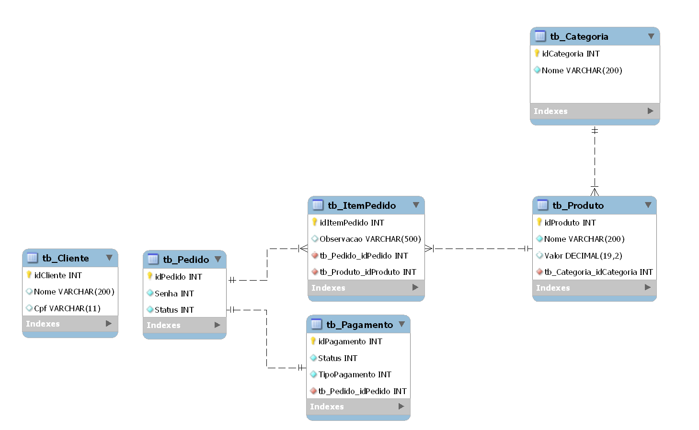

# Fiap Infra DB

Para a modelagem do sistema de gerenciamento de pedido do restaurante optou-se por empregar um banco de dados relacional, mais precisamente o MySQL, com base nas seguintes justificativas:

-   Armazenamento de dados de clientes, pedidos, produtos, pagamento e acompanhamento do pedido possui informações estruturadas e que necessitam de um relacionamento para manter a __estrutura de dados organizado__;

-   Nessecidade de insigts e relatórios para campanhas promocionais, para isso é preciso executar __consultas complexas__;

-   Os pedidos não podem contem erros de dados e não podem ser duplicados, é preciso __integridade dos dados__;

-   Necessidade de transações __seguras e consistente__ para o pagamento.

### Modelo físico de dados

    

